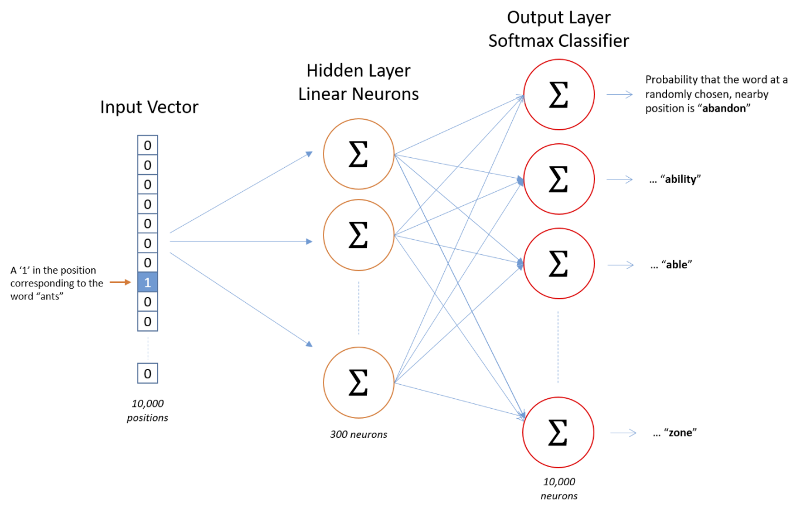
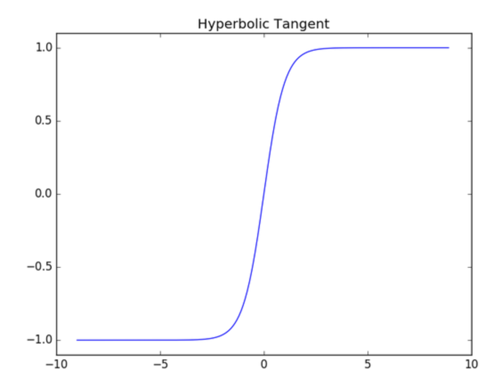

# Deep Learning for NLP: Sentence Classification

In this series of blog posts I will outline two highly effective approaches to classifying sentences.  This first post will cover a less freqently seen approach.... convolutional neural networks.

Although traditionally used for image processing tasks, [CNN's have proven very effective at various NLP tasks](https://arxiv.org/pdf/1702.01923.pdf). Lets dreak down the model, step by step:

## Word2vec

Word2vec is a simple and elegant model, which allows us to map each unique word in our data to a vector which represents it's context.  

Let's assume we have 10,000 unique words in our data.  This is our corpus.

Each input is a word, represented as a vector length 10,000.  The vector is zero in all positions, except the position corresponding to the word.

The output layer is also a vector of length 10,000.  However, this time the values represent the probability that a word appears in a predefined window around the input word.

*Chris McCormick, (2017), word2vec architecture [ONLINE]. Available at: http://mccormickml.com/assets/word2vec/skip_gram_net_arch.png [Accessed 14 November 2017].*

The model consists of a single hidden layer neural network, with linear activation at the neurons. The softmax loss function is used.

Now we simply chose a hidden layer size (300 above) and train the model.  The beauty here is that the weights learned represent the context of a given input word.

For example, we would expect very similar words to appear around the words "king" and "queen".  Therefore, the row of weight matrix corresponding to both words should be similar.

Now we can simply build a lookup table, where each word in our corpus is represented by a vector (length 300 in this case).  This vector is known as the word embedding.

### Limitations

The topic of this post is sentence classification.  We need to find a way to represent a sentence numerically for input to our model.  One simple approach is to average the word embeddings in each sentence.  We can then input a sentence to our model as a vector length 300.  But wouldn't it be great if there were a way to retain each words' individual embedding? Enter the CNN.

## Convolutional text model

The architecture of our deep learning model is as shown below:

*Source: Zhang, Y., & Wallace, B. (2015). A Sensitivity Analysis of (and Practitioners’ Guide to) Convolutional Neural Networks for Sentence Classification.*

### Input

Each sentence in our data is represented by a matrix of size w by d, where d is the hidden layer size in our word2vec model and w is our prechosen maximum sentence length.  The first row of the input example above represents the embedding for the word "I" in our corpus.

Padding is used to ensure our sentences are all the same length.  This simply consists of removing words or adding empty words to sentences such that they are all the same length.

### Convolutions

The next layer of our network consists of many convolutions of the input.  The filters in this model have width = embedding length.  The filter slides over the input performing elementwise multiplication.

The result is then summed, before applying an activation function to the output.

### Pooling and concatenating layer

The maximum value from each filter is taken in the pooling layer.  The values from the 6 filters are concatenated into a single vector.

### Fully connected layer

This vector is passed to a fully connected layer with size = number of classes we wish to predict to.  This layer utilizes the softmax activation, to ensure the output is between 0 and 1.  This is useful because we want each neuron to represent the probability that the input sentence belongs to class 0, 1, 2, 3 etc.

## The code

[This code](https://mxnet.incubator.apache.org/tutorials/nlp/cnn.html) shows how to implement this model in MXNet (Amazon's deep learning framework of choice).

## Hyperparameter tuning

My findings from implementing the above architecture were as follows:

- tanh activation function was best on convolutional layers
- embedding length 600 most effective
- preprocessing text was critical
- 200 filters of sizes 3,4 and 5
- Adam optimizer
- random weight initialization